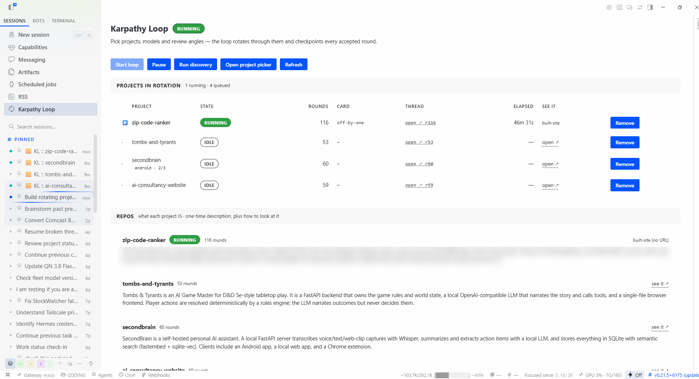
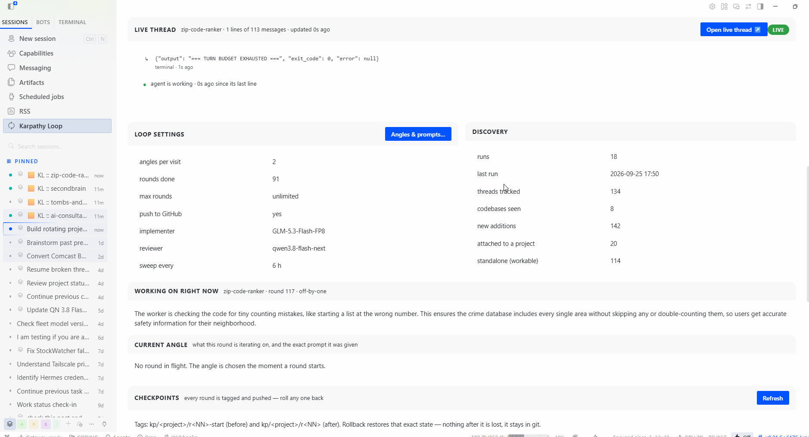
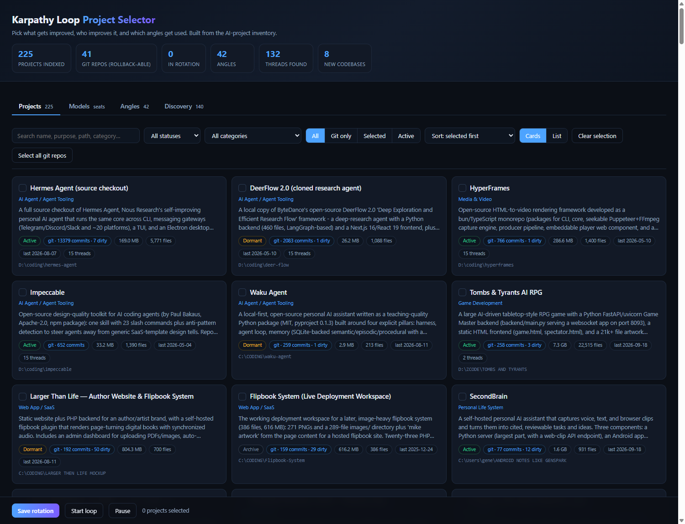

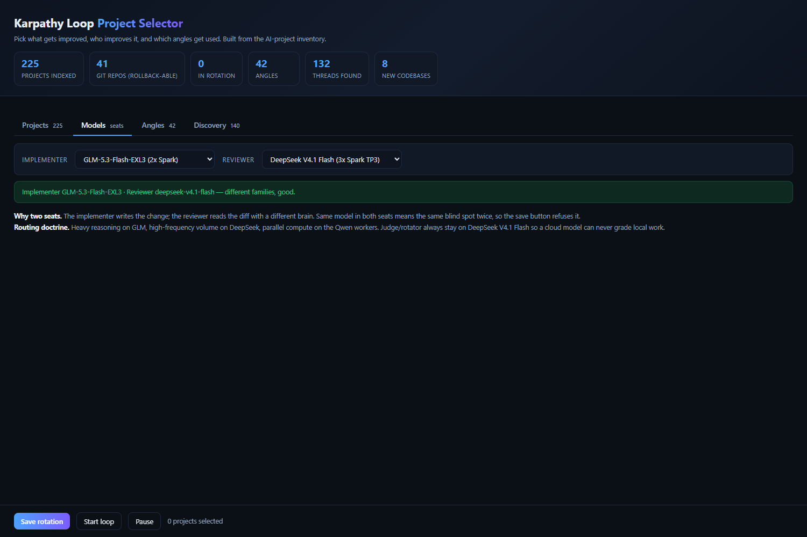
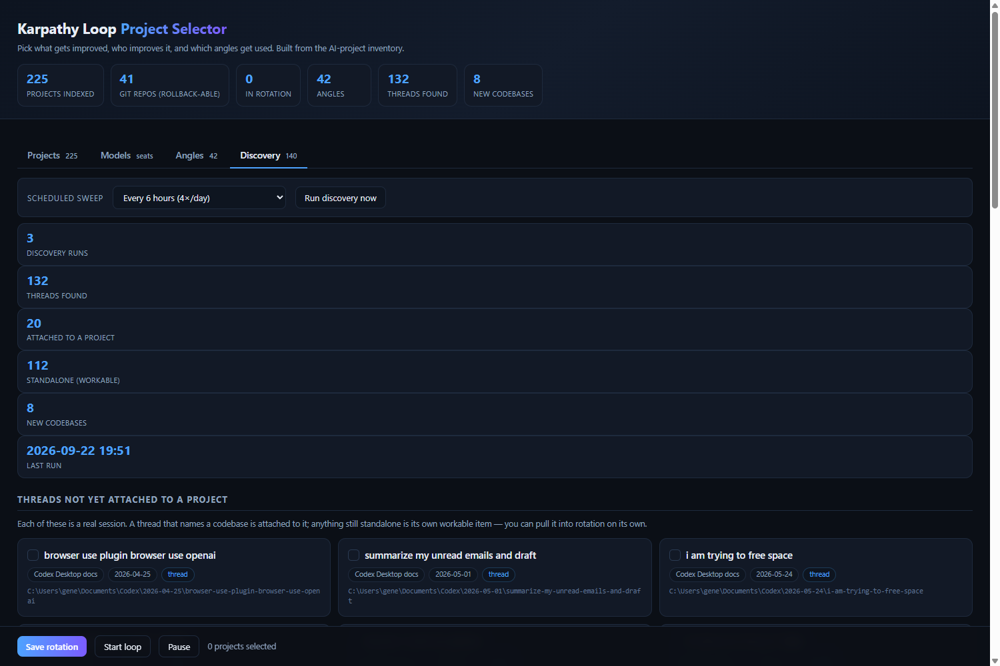

# Hermes Karpathy Loop

**An autonomous, self-improving code loop for your own repositories.**

The Karpathy Loop runs a continuous improve-review-improve cycle over the git
repos you point it at:

1. **Pick** a project and a review angle (robustness, dead code, invisible
   state, lying tests, ... 8 families, 168+ concrete prompts).
2. **Isolate** — every round works in a disposable `git worktree` branched from
   your canonical checkout. Your working tree is never touched.
3. **Work** — an agent (any OpenAI-compatible model, local or cloud) hunts one
   specific flaw, fixes it, and writes real tests.
4. **Gate** — the round is only accepted if YOUR gate command passes (pytest,
   npm test, whatever you configure). No gate, no merge.
5. **Checkpoint** — accepted work is committed, tagged `kp/<project>/r<NN>`,
   and optionally pushed to GitHub. Rejected work is rolled back and the repo
   quarantined if anything looks unsafe.
6. **Rotate** — to the next project, forever.

## Why it exists

Most "AI improves your codebase" tools demo well and drift. This one is built
around a harsh acceptance chain, because the interesting failure mode of an
autonomous loop is not "it does nothing" — it is "it confidently merges junk":

- **Acceptance = exit 0 AND your gate passed AND the git head advanced AND the
  proposal survived review.** Four conditions, all required.
- **A checkpoint is a claim**: tags are cut only after the round is fully
  persisted, never before.
- **Refusal over rollback**: a dirty tree at round start is refused, never
  wiped. The loop would rather stall than destroy uncommitted human work.
- **Containment**: rejected rounds roll the worktree back to the pre-round
  HEAD; if even that cannot be verified, the repo is quarantined and parked
  until a human looks.
- **Honesty in the UI**: the dashboard computes liveness from the runner's
  heartbeat and live processes — a wedged loop reads as WEDGED, never as
  "running".

## What it looks like

| The dashboard: projects in rotation, live state, round counts | Live thread, loop settings, plain-English "working on right now" |
|---|---|
|  |  |

| Project picker | Angles & prompts | Models | Discovery |
|---|---|---|---|
|  |  |  |  |

## What's in here

| Path | What it is |
|---|---|
| `karpathy_runner.py` | The round engine: worktrees, gates, containment, checkpointing, rotation |
| `loopctl.py` | Operator control plane: `start/pause/stop/status`, liveness + wedge detection |
| `checkpoint.py` | Tag/push checkpointing + the plain-English summarizer (5th-grade explanations of every round) |
| `settings.py` | The layered config layer (defaults → settings.yaml → settings.local.yaml → env) + validation |
| `notify_senders.py` | Pluggable message-platform layer: sender interface + registry (`discord` \| `none`; slack/telegram drop in) |
| `activity.py`, `monitor.py`, `monitor.html` | Dashboard payloads + a standalone HTML monitor |
| `scope.py`, `surface_pick.py`, `round_prompt.py`, `round_evidence.py` | Campaign/surface tracking and per-round prompt/evidence discipline |
| `angles*.py`, `angles.yaml`, `angle_prompts.yaml` | The review-angle library |
| `widget/plugin.js` | Hermes Desktop plugin: live dashboard page (status, repos, live thread, checkpoints, plain-English "working on right now") |
| `scripts/status_server.py` | Local HTTP server that feeds the widget without touching the agent shell queue |
| `tests/` | ~270 tests pinning the safety properties (acceptance chain, containment wiring, refusal-on-dirty, wedge detection, ...) |
| `improve.yaml` | Your project manifest (example provided) |

## Quick start

```bash
git clone https://github.com/genetrader/Hermes-Karpathy-Loop.git
cd Hermes-Karpathy-Loop
pip install pyyaml requests

# 1. tell it about your projects (name, path, gate command)
cp improve.yaml my-improve.yaml   # then edit

# 2. start the loop (safe defaults: GitHub off, notifications off, local tags only)
python loopctl.py start

# 3. watch it
python loopctl.py status
python monitor.py --serve          # or open the desktop widget
```

## Configuration

**One file decides everything machine-specific: `settings.py` reads a layered
config and every module goes through it.** No token, home directory, model
name, or server address is ever hardcoded in the loop.

```
built-in defaults          safe: GitHub OFF, notifications OFF, no models set
settings.yaml              tracked; team-shared; NO secrets allowed
settings.local.yaml        gitignored; your machine; secrets allowed here
environment variables      final override, highest priority
```

Later layers win, leaf by leaf. A secret **value** (`github.token`,
`notifications.bot_token`) in the *tracked* `settings.yaml` is rejected by
validation and dropped — the tracked file may only **name an env var**
(`token_env: GITHUB_TOKEN`). `loopctl settings validate` prints every problem
with the exact dotted key and the fix; `loopctl settings show` prints the
effective config with secrets masked; `loopctl settings set <key> <value>`
writes `settings.local.yaml` (add `--tracked` for `settings.yaml`, secrets
refused). The shipped `settings.yaml` is a documented example of every key.

### `github.*` — publishing checkpoints

| Key | Default | Meaning |
|---|---|---|
| `github.enabled` | `false` | Master switch. **OFF = local tags only**: the round's `kp/<project>/r<NN>` tag is cut locally, every push is skipped silently (supported mode, not an error). Nothing talks to GitHub. |
| `github.owner` | `""` | Your GitHub username (hints for repo creation). |
| `github.token_env` | `GITHUB_TOKEN` | NAME of the env var holding your token. |
| `github.token` | unset | Token value — allowed only in `settings.local.yaml` or the environment. |
| `github.require_repo` | `false` | Refuse rounds on repos with no git remote. |
| `github.gh_cli` | `gh` | Path to the `gh` binary if not on PATH. |
| `github.push_branches` | `true` | Push the working branch each round; `false` = tags only. |

The runtime toggle `loopctl config --push-github false` turns pushes off on
top of these, per deployment. When a token resolves, pushes authenticate
non-interactively (bearer header); with none, git fails fast instead of
opening a credential dialog — a headless round can never hang on a prompt.

### `notifications.*` — pluggable messaging

| Key | Default | Meaning |
|---|---|---|
| `notifications.enabled` | `false` | Master switch. OFF = every message is a silent no-op (no token lookup, no network). |
| `notifications.backend` | `none` | `discord` \| `none`. Senders are pluggable: `notify_senders.py` holds the sender interface + registry; adding `slack`/`telegram` is one registered class, zero call-site changes. |
| `notifications.include_summaries` | `true` | Round messages carry the plain-English (fifth-grade) summary of what the round is doing/did — produced by the checkpoint.py summarizer, cached per round, never blocking a round on the LLM. |
| `notifications.bot_token_env` | `DISCORD_BOT_TOKEN` | NAME of the env var with the bot token. |
| `notifications.bot_token` | unset | Token value — `settings.local.yaml` / env only. |
| `notifications.channel_id` | `""` | The channel the loop posts into. |
| `notifications.ping_user_id` | `""` | User id @mentioned on questions. |
| `notifications.ping_on_stuck` | `false` | Also @mention when the loop reports STUCK. |
| `notifications.env_file` | `""` | Optional KEY=VALUE file (e.g. Hermes' `.env`) to read the above from; falls back to the Hermes home `.env`. |

Message classes: **progress** (quiet post, no ping, includes the 💬 plain-English
round summary when enabled), **stuck** (`[STUCK]` prefix, ping only with
`ping_on_stuck`), **question** (`@` ping, repeated until answered or the
loop records its best assumption).

### `models.*` — which models the loop agents use

| Key | Env | Meaning |
|---|---|---|
| `models.implementer` | `KL_BUILDER_MODEL_SEAT` | The implementer seat — `provider:model` (or `custom:<slug>:<model>`). Seeds `loopctl config --implementer`; loop.json still wins at runtime. |
| `models.reviewer` | `KL_REVIEWER_MODEL_SEAT` | The reviewer seat. Must be a DIFFERENT model (validated: a model cannot review its own work). |
| `models.builder_fallback` | `KL_BUILDER_MODEL` | Seat used when loop.json has no implementer. |
| `models.brief_model` / `brief_profile` | `KL_BRIEF_MODEL` / `KL_BRIEF_PROFILE` | Model for the one-shot repo briefs (empty = deterministic facts-only brief). |
| `models.summary_url` / `summary_model` | `KL_LLM_URL` / `KL_LLM_MODEL` | The plain-English summary LLM: any OpenAI-compatible `/v1/chat/completions` endpoint. Unset = summaries skipped (no hardcoded fallback server). |
| `models.summary_url_2` / `summary_model_2` | `KL_LLM_URL_2` / `KL_LLM_MODEL_2` | Optional fallback endpoint. |

The runner refuses to start on a malformed or dead seat (`provider:model`
form is validated against the Hermes provider list before round one), so a
typoed seat is a startup error, not hours of silent failure.

### `hermes.*`, `projects.*`, `runtime.*`

| Key | Default | Meaning |
|---|---|---|
| `hermes.home` | `~/.hermes` / `%LOCALAPPDATA%\hermes` | Hermes home (env `HERMES_HOME`). |
| `hermes.python` | `<home>/hermes-agent/venv/...` | Interpreter launching hermes CLI children (env `KL_HERMES_PYTHON`). |
| `hermes.profile` | `default` | Hermes profile the loop threads run under. |
| `hermes.config_file` | `<home>/config.yaml` | Validated against model seats. |
| `projects.manifest` | `./improve.yaml` | Project manifest (env `KL_MANIFEST`). |
| `projects.index_rows` | unset | Optional `rows.json` seed for discovery (env `KL_INDEX_ROWS`). |
| `runtime.round_timeout` | `4200` | Hard ceiling per round, seconds (env `KL_ROUND_TIMEOUT`). |
| `runtime.worktree_abandon_secs` | `21600` | Age after which an abandoned worktree quarantines its repo. |
| `runtime.gate_timeout` | `900` | Default gate-command timeout (per-project `gate_timeout` overrides). |

Discovery sweep roots default to your home folder; set `KL_SWEEP_ROOTS`
(os-pathsep-separated) to choose your own.

## Status

Production-tested on four active repositories; 100+ accepted rounds, every
safety property pinned by tests. Built for (and with) the
[Hermes Agent](https://github.com/NousResearch/hermes-agent) desktop app, but
the engine itself is just Python + git and runs anywhere.

## License

MIT
